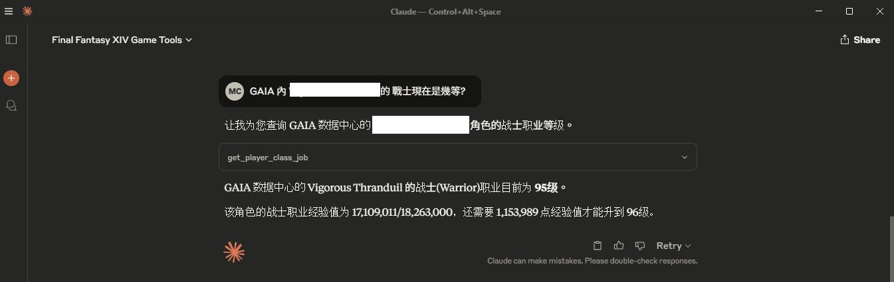
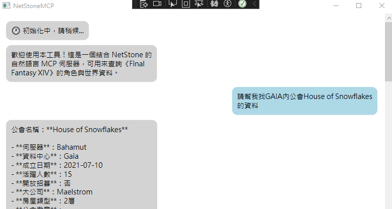
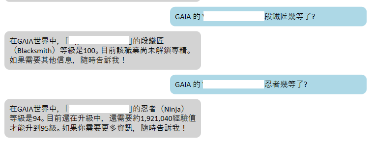
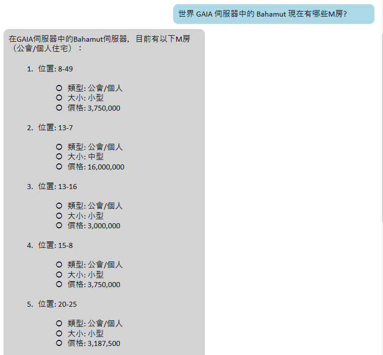

# NetStone.MCP

🧩 MCP Toolset for FFXIV Lodestone — Integrates [NetStone](https://github.com/xivapi/NetStone) into a natural-language-capable MCP server for querying character and world data from Final Fantasy XIV.

## Overview

This project transforms the powerful, modern `.NET` FFXIV Lodestone API library **NetStone** into a set of Model Context Protocol tools, allowing you to use natural language prompts to query Lodestone data via an MCP-compatible LLM client such as OpenAI or Claude.


## Data Source

* [NetStone](https://github.com/xivapi/NetStone)
* [FFXIV_PaissaHouse](https://github.com/zhudotexe/FFXIV_PaissaHouse)
* [FFXIVStore](https://store.finalfantasyxiv.com/ffxivstore/en-us/)

## Setup

* Claude Desktop

add mcpServers in `claude_desktop_config.json`

```json
{
  "mcpServers": {
    "NetStone MCP Server" :{
      "command": "dotnet",
      "args": [
        "run",
        "--project",
        // NetStoneMCP.csproj path ex:
        "C:\\Users\\Desktop\\NetStoneMCP\\src\\NetStoneMCP.csproj",
        "--no-build"
      ]
    }
  }
}
```

* Custom WPF

```shell
export OPENAI_API_KEY=your_api_key_here
dotnet run --project tests\NetStoneClient\NetStoneClient.csproj
```

* ChatGPT Desktop

I hope ChatGPT Desktop will support adding MCP soon.

## Sample

* Claude Desktop



<br>

* Custom Console

<br>


<br>

* Custom WPF

<br>



<br>



<br>




## Features (Planned or Implemented)

✅ = Implemented  
🛠️ = In Progress  
🔜 = Planned

- ✅ **Character Search Tool**  
  Search for FFXIV characters by name and world.

- ✅ **Character Profile Tool**  
  Fetch detailed character profiles (job levels, biography, etc).

- ✅ **Free Company Search Tool**  
  Search for Free Companies by name and server.

- ✅ **Free Company Profile Tool**  
  Retrieve members, activities, and rank data.

- ✅ **World List Tool**  
  List all supported FFXIV worlds.

- ✅ **House List Tool**  
  List all purchasable houses.

- 🔜 **Store List Tool** 
  TBD

