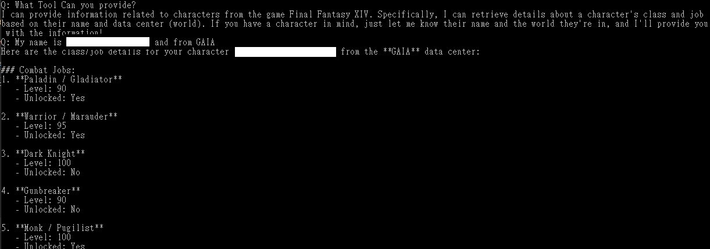
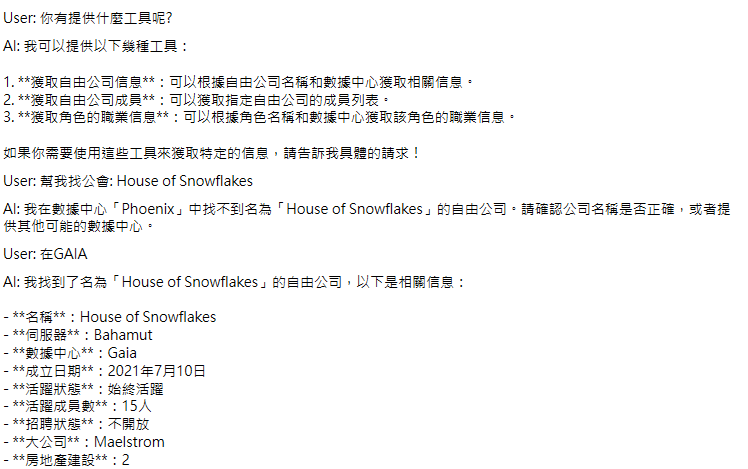

# NetStone.MCP

🧩 MCP Toolset for FFXIV Lodestone — Integrates [NetStone](https://github.com/xivapi/NetStone) into a natural-language-capable MCP server for querying character and world data from Final Fantasy XIV.

## Overview

This project transforms the powerful, modern `.NET` FFXIV Lodestone API library **NetStone** into a set of Model Context Protocol tools, allowing you to use natural language prompts to query Lodestone data via an MCP-compatible LLM client such as OpenAI or Claude.

## Quick Preview

* Console

* WPF

## Features (Planned or Implemented)

✅ = Implemented  
🛠️ = In Progress  
🔜 = Planned

- 🔜 **Character Search Tool**  
  Search for FFXIV characters by name and world.

- 🔜 **Character Profile Tool**  
  Fetch detailed character profiles (job levels, biography, etc).

- 🔜 **Free Company Search Tool**  
  Search for Free Companies by name and server.

- 🔜 **Free Company Profile Tool**  
  Retrieve members, activities, and rank data.

- 🔜 **World List Tool**  
  List all supported FFXIV worlds.

