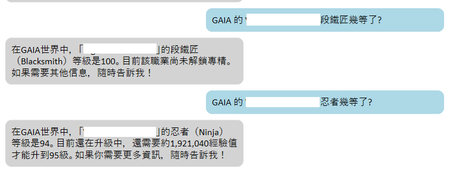

# NetStone.MCP

[](https://deepwiki.com/dks50217/NetStoneMCP)

MCP Toolset for FFXIV Lodestone — Integrates [NetStone](https://github.com/xivapi/NetStone) into a natural-language-capable MCP server for querying character and world data from Final Fantasy XIV.

[](https://notbyai.fyi/hi/not-by-ai/)

## Overview

This project transforms FFXIV Lodestone API library NetStone, along with other external APIs, into a set of Model Context Protocol (MCP) tools. It enables users to query Lodestone and related game data using natural language prompts through any MCP-compatible LLM client such as OpenAI or Claude.


## Data Source

* [NetStone](https://github.com/xivapi/NetStone)
* [FFXIV_PaissaHouse](https://github.com/zhudotexe/FFXIV_PaissaHouse)
* [FFXIVStore](https://store.finalfantasyxiv.com/ffxivstore/en-us/)
* [XIVAPI](https://github.com/xivapi)
* [FFXIV Lodestone News](https://lodestonenews.com/)
* [Thaliak](https://thaliak.xiv.dev/)
* [FFXIV Collect](https://ffxivcollect.com/)

## Setup

[Setup](./sample/README.md)

## Sample

* Claude Desktop


<br>

* Custom Console

<br>


<br>

* Custom WPF

<br>


<br>



## Features

- [x] Character search — Search for FFXIV characters by name and world.
- [x] Character profile details — Fetch detailed character profiles.
- [x] Free Company search — Search for Free Companies by name and server.
- [x] Free Company profile details — Retrieve Free Company members and data.
- [x] World list — List all supported FFXIV worlds.
- [x] House list — List all purchasable houses.
- [x] Store list — List store categories. 
- [x] search for products by specifying a category name.
- [x] Collectibles search — Query mounts, minions, emotes, hairstyles, orchestrions, blue mage spells, bardings, fashions, and achievements via FFXIV Collect.

## Example Prompts

Once connected to your MCP client (Claude Desktop, Discord Bot, or custom UI), you can interact with NetStoneMCP using natural language:

### Collectibles & Glamour (FFXIV Collect)
* *"How can I get the Fatter Cat mount? How many seats does it have?"*
* *"Where does the Major-General shark minion drop?"*
* *"What is the command for the Savor Tea emote, and how do I unlock it?"*
* *"Where can I learn the Blue Mage spell 'Moon Flute'?"*
* *"How do I unlock the Practical Ponytails hairstyle?"*
* *"What title reward do you get from the 'Pal-less Palace III' achievement?"*
* *"How do I get the Neath Dark Waters orchestrion roll?"*

### Characters & Free Companies (Lodestone & NetStone)
* *"Look up the character 'Tataru Taru' on world 'Carbuncle' and show their class/job levels."*
* *"Search for the Free Company 'Chocobo' on 'Bahamut' and list its members."*
* *"How many mounts does the character have?"*

### Housing & Servers (PaissaHouse & Server Status)
* *"Are there any available houses to buy on Tonberry world in Elemental data center?"*
* *"What is the character creation availability status for Traditional Chinese servers?"*
* *"List all data centers and worlds."*

### News, Maintenance & Versions (Lodestone News & Thaliak)
* *"Is there any ongoing or upcoming FFXIV server maintenance?"*
* *"Summarize the latest topics and news from the Lodestone website."*
* *"What are the latest game version numbers for FFXIV and its expansions?"*
* *"Get the latest community Traditional Chinese localization patch release."*

### Online Store
* *"What items are currently on sale in the FFXIV Online Store?"*
* *"Show me the newest products added to the store."*

## Quick Setup - Docker for Discord Bot

1. Create a `.env` file in the project root and add your keys:

    ```env
    OPENAI_API_KEY=your_openai_api_key
    DISCORD_BOT_KEY=your_discord_bot_token
    ```

2. Build the Docker image:

    ```sh
    docker build -f ./dockerfile -t netstone-mcp .
    ```

3. Start the container with Docker Compose

    ```sh
    docker compose up -d
    ```

> Make sure the `.env` file is in the same directory as your `docker-compose.yml`.


