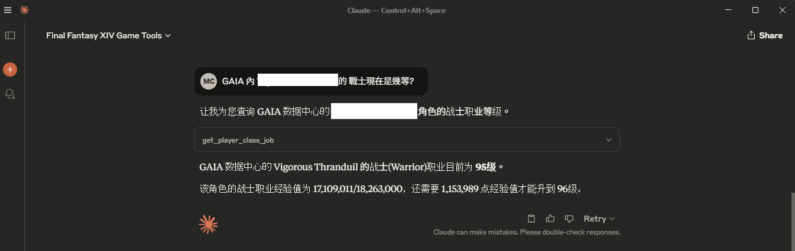
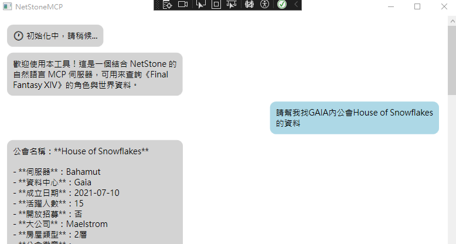
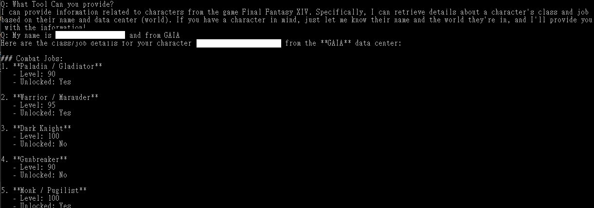

# NetStone.MCP

[](https://deepwiki.com/dks50217/NetStoneMCP)
[](https://dotnet.microsoft.com/)

A [Model Context Protocol (MCP)](https://modelcontextprotocol.io/) server for Final Fantasy XIV, built with .NET 8.

NetStone.MCP connects LLM clients (Claude Desktop, Cursor, ChatGPT, custom Discord bots, and autonomous agents) directly to FFXIV game data, including official Lodestone character and FC data, PaissaDB real-time housing availability, FFXIV Collect items & mounts, XIVAPI v2 recipes, and Chinese community lore/wiki databases.

Supports both **Stdio** (local process) and **HTTP / SSE** (remote server) transport modes.

---

## Data Sources

| Source | Integration | Powered Capabilities |
|---|---|---|
| **[NetStone](https://github.com/xivapi/NetStone)** | Lodestone Scraper | Character profiles, class/job levels, mount counts, Free Companies, Linkshells |
| **[PaissaHouse](https://github.com/zhudotexe/FFXIV_PaissaHouse)** | PaissaDB API | Real-time purchasable housing plots, sizes, prices, and lottery entries |
| **[FFXIV Collect](https://ffxivcollect.com/)** | Collect API | Mounts, minions, emotes, hairstyles, orchestrions, BLU spells, bardings, fashions, achievements |
| **[Huiji Wiki (灰机Wiki)](https://ff14.huijiwiki.com/)** | MediaWiki API | Chinese lore, quests, dungeons/raids, boss mechanics, items, and translations |
| **[XIVAPI v2](https://xivapi.com/)** | XIVAPI REST | Item search, crafting recipes, and ingredient breakdowns |
| **[FFXIV Lodestone News](https://lodestonenews.com/)** | News API | Official maintenance schedules, topics, and news articles |
| **[Thaliak](https://thaliak.xiv.dev/)** | Patch Tracker | Latest game client and expansion version numbers |
| **Square Enix Store** | Store Scraper | Online store categories, new releases, and discounted items |

---

## Quickstart

### 1. Claude Desktop (Stdio Mode)

Add NetStone.MCP to your `claude_desktop_config.json`:

```json
{
  "mcpServers": {
    "netstone-mcp": {
      "command": "dotnet",
      "args": [
        "run",
        "--project",
        "C:\\path\\to\\NetStoneMCP\\src\\NetStoneMCP.csproj",
        "--no-build"
      ]
    }
  }
}
```

### 2. HTTP / SSE Mode (Cursor, VS Code, Remote Clients)

Launch NetStone.MCP with the `SSE` transport:

```bash
export TransportType=SSE
dotnet run --project src/NetStoneMCP.csproj
```

The MCP SSE endpoint will listen on:
```
http://localhost:5000/sse
```

### 3. Docker Compose (Server + Discord Bot)

Run NetStoneMCP and the sample Discord bot with a single command:

```bash
cp .env.example .env
# Edit .env and supply OPENAI_API_KEY and DISCORD_BOT_KEY
docker compose up -d --build
```

---

## Available MCP Tools

### Character & Social (Lodestone)
| Tool | Description |
|---|---|
| `get_player_info` | Character profile (level, avatar, grand company, FC, bio) by name and world. |
| `get_player_class_job` | All combat, crafter, and gatherer levels for a character. |
| `get_character_mount_count` | Total mount count unlocked by a character. |
| `get_fc_information` | Free Company profile, rank, slogan, and active buffs. |
| `get_fc_members` | Full member roster of a Free Company. |
| `get_crossworld_linkshell_information` | CWLS profile and member list by name and data center. |
| `get_linkshell_information` | Linkshell profile and member list by name and world. |

### Collectibles & Unlockables (FFXIV Collect)
| Tool | Description |
|---|---|
| `get_ffxiv_mount` | Mount acquisition sources, seats, patch, and tradeability. |
| `get_ffxiv_minion` | Minion drop locations, sources, and descriptions. |
| `get_ffxiv_emote` | Emote unlock command (`/emote`), source, and patch. |
| `get_ffxiv_hairstyle` | Modern Aesthetics hairstyle acquisition methods (MGP, PvP, Bozja, etc.). |
| `get_ffxiv_orchestrion` | Music sheet roll numbers, categories, and drop sources. |
| `get_ffxiv_blue_mage_spell` | BLU spell learning requirements (carnivale, dungeon, overworld mob). |
| `get_ffxiv_barding` | Chocobo barding sources and tradeability. |
| `get_ffxiv_fashion` | Fashion accessories (wings, umbrellas/parasols, glasses, backpacks). |
| `get_ffxiv_achievement` | Achievement points, requirements, and rewards (titles, mounts, items). |
| `search_ffxiv_collectable` | Multi-category collectible query across all collectible types. |

### Lore & Wiki Database (Huiji Wiki / 灰机Wiki)
| Tool | Description |
|---|---|
| `search_huiji_wiki` | Search Chinese FFXIV database for quests, dungeons, lore, NPCs, and mechanics. |
| `get_huiji_wiki_summary` | Get a concise summary and introduction for a topic or page. |
| `get_huiji_wiki_page_section` | Fetch full section content (e.g. strategy guides, background lore, drop lists). |

### Items & Crafting (XIVAPI v2)
| Tool | Description |
|---|---|
| `get_item_by_name` | Item lookup by name with item IDs and metadata. |
| `get_item_recipes` | Crafting recipe breakdown, required craft levels, and ingredient lists. |

### Housing & Server Status
| Tool | Description |
|---|---|
| `get_house_information` | Available purchasable housing plots, sizes, prices, and lottery entries (PaissaDB). |
| `get_data_center` | List all official Data Centers. |
| `get_world` | List all Worlds and their assigned Data Centers. |
| `get_ffxiv_cht_lock_server` | Current character creation lock status for Traditional Chinese servers. |

### News, Versions & Online Store
| Tool | Description |
|---|---|
| `ffxiv_get_current_maintenance` | Current and upcoming maintenance schedules and descriptions. |
| `ffxiv_get_topics` | Latest official news and topics from the Lodestone. |
| `ffxiv_get_post` | Full text content for a specific Lodestone post by ID. |
| `get_ffxiv_latest_versions` | Latest patch version strings for base game and expansions (boot, ex1–ex5). |
| `get_ffxiv_latest_chn_text_patch` | Latest community Traditional Chinese localization release download link. |
| `get_store_categories` | Available product categories in the FFXIV Online Store. |
| `get_store_new_product` | Newly added items in the Online Store. |
| `get_store_on_sale_product` | Items currently discounted in the Online Store. |
| `get_store_product` | Filter store items by category name. |

---

## Sample Applications

Ready-to-use sample clients are available under the [`sample/`](./sample/) directory:

### 1. Discord Bot (`sample/NetStoneDiscordBot`)
A Discord bot powered by OpenAI Function Calling and NetStoneMCP tools with channel context memory.

#### Roleplay Persona Switching (`!skill`)
Switch character personas at any time in chat. Personas are defined as Markdown templates under `sample/NetStoneDiscordBot/Skills/`:

| Persona Command | Character | Description & Aliases |
|---|---|---|
| `!skill 雅修特拉` | 雅·修特拉 (Y'shtola) | 拂曉大魔女，知性優雅、微毒舌、以太學大師（永遠的23歲）。別名：`yshtola`, `貓娘`, `魔女` |
| `!skill 愛梅特賽爾克` | 愛梅特賽爾克 (Emet-Selch) | 厭世傲慢但深情博學的原初之人（「記住我們曾經活過」）。別名：`emetselch`, `愛梅`, `哈迪斯` |
| `!skill 古拉哈提亞` | 古拉哈·提亞 (G'raha Tia) | 熱情坦率、憧憬英雄的拂曉賢人，喜愛美食與冒險。別名：`grahatia`, `水晶公`, `貓男` |
| `!skill 塔塔露` | 塔塔露 (Tataru) | 拂曉財政總管與裁縫神匠，滿口「是也！」、寸步不讓。別名：`tataru`, `大掌櫃`, `拉拉肥` |
| `!skill 阿莉塞` | 阿莉塞 (Alisaie) | 率真好勝、傲嬌熱血的赤魔少女，吐槽阿爾菲諾毫不留情。別名：`alisaie`, `赤魔` |
| `!skill 艾斯蒂尼安` | 艾斯蒂尼安 (Estinien) | 孤高寡言的蒼天龍騎，實力超群但金錢觀薄弱。別名：`estinien`, `大師兄`, `龍騎` |
| `!skill 猴子` | 猴子 (Monkey) | 機靈幽默的香蕉猴子。別名：`monkey` |
| `!skill off` / `default` | 預設模式 | 客觀中立的專業 FFXIV 知識庫助理。 |

### 2. WPF Desktop Client (`sample/NetStoneClient`)
A desktop chat application built with WPF, integrating OpenAI chat completions with NetStoneMCP tool invocation.

---

## Configuration & Environment Variables

| Variable | Default | Description |
|---|---|---|
| `TransportType` / `TRANSPORT_TYPE` | `Stdio` | MCP transport mode: `Stdio` (standard I/O) or `SSE` (HTTP Server-Sent Events). |
| `NETSTONE_SSE_URL` | `http://localhost:5000/sse` | Endpoint used by clients/bots when running in SSE mode. |
| `OPENAI_API_KEY` | *(None)* | OpenAI API Key (required for Discord Bot and WPF Client). |
| `OPENAI_MODEL` | `gpt-5.1` | LLM model used by sample clients. |
| `DISCORD_BOT_KEY` | *(None)* | Discord Bot Token (required for Discord Bot). |

---

## Screenshots

<p align="center">
  
  <br/><em>Claude Desktop querying Lodestone data via Stdio MCP</em>
</p>

<p align="center">
  
  <br/><em>WPF Desktop Client calling NetStoneMCP tools</em>
</p>

<p align="center">
  
  <br/><em>Interactive Console Client</em>
</p>

---

## Development

```bash
# Build the entire solution
dotnet build src/NetStoneMCP.sln

# Run all automated tests
dotnet test src/NetStoneMCP.sln
```
