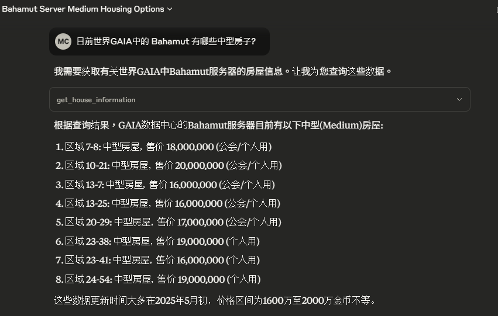

# NetStone.MCP

🧩 MCP Toolset for FFXIV Lodestone — Integrates [NetStone](https://github.com/xivapi/NetStone) into a natural-language-capable MCP server for querying character and world data from Final Fantasy XIV.

## Overview

This project transforms FFXIV Lodestone API library NetStone, along with other external APIs, into a set of Model Context Protocol (MCP) tools. It enables users to query Lodestone and related game data using natural language prompts through any MCP-compatible LLM client such as OpenAI or Claude.

## Data Source

* [NetStone](https://github.com/xivapi/NetStone)
* [FFXIV_PaissaHouse](https://github.com/zhudotexe/FFXIV_PaissaHouse)
* [FFXIVStore](https://store.finalfantasyxiv.com/ffxivstore/en-us/)

## Setup

[Setup](./sample/README.md)

## Sample

* Claude Desktop

 

* Custom Console

 

 

* Custom WPF

 

 

## Features (Planned or Implemented)

✅ = Implemented  
🛠️ = In Progress  
🔜 = Planned

- ✅ **Character Search Tool**  
  Search for FFXIV characters by name and world.

- ✅ **Character Profile Tool**  
  Fetch detailed character profiles (job levels, biography, etc).

- ✅ **Free Company Search Tool**  
  Search for Free Companies by name and server.

- ✅ **Free Company Profile Tool**  
  Retrieve members, activities, and rank data.

- ✅ **World List Tool**  
  List all supported FFXIV worlds.

- ✅ **House List Tool**  
  List all purchasable houses.

- 🔜 **Store List Tool** 
  TBD

